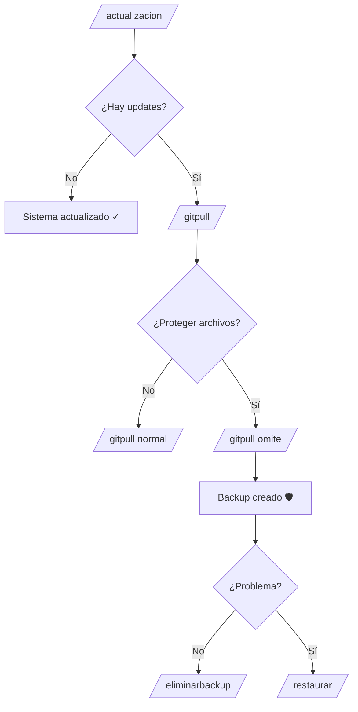

<div align="center">


  
<br><br>
  
<a href="https://github.com/Luna-botv6/Luna-Botv6-Project">
  
</a>

<br><br>

<p>
  <a href="https://github.com/Luna-botv6/Luna-Botv6-Project">
    
  </a>
  <a href="https://nodejs.org">
    
  </a>
  <a href="LICENSE">
    
  </a>
</p>

<p>
  <a href="https://whatsapp.com/channel/0029VbANyNuLo4hedEWlvJ3Y">
    
  </a>
  
  
</p>

<br>

<table>
<tr>
<td align="center">

---
  
## 💫 **La Experiencia Definitiva en WhatsApp**

```js
const LunaBot = {
  caracteristicas: [
    "✨ Bot avanzado y altamente personalizable",
    "🎯 Herramientas útiles para el día a día",
    "🎮 Entretenimiento sin límites",
    "🛡️ Moderación inteligente de grupos",
    "🤖 Comandos inteligentes con IA",
    "⚡ Respuestas rápidas y eficientes"
  ],
  estado: "🔥 ACTIVO",
  version: "6.0"
};
---

```

</td>
</tr>
</table>

<br>

<table>
<tr>
<td align="center" width="25%">
  
  <br><sub><b>Útiles y Prácticas</b></sub>
</td>
<td align="center" width="25%">
  
  <br><sub><b>Entretenimiento Total</b></sub>
</td>
<td align="center" width="25%">
  
  <br><sub><b>Control de Grupos</b></sub>
</td>
<td align="center" width="25%">
  
  <br><sub><b>Inteligencia Artificial</b></sub>
</td>
</tr>
</table>

<br>

<p>
  
  
  
</p>


<br><br>


</div>

---

## 🆕 Últimas Actualizaciones

<table>
<tr>
<td>

## ## ✅ 22/12/2025 – Optimización de Metadata y Sistema de Menciones 🚀

### ⚡ Handler.js
- ✅ Eliminado caché pesado (`getGroupMetadataOptimized`, Maps innecesarios)
- ✅ Metadata se obtiene UNA sola vez por mensaje (75% más rápido)
- ✅ Estructura correcta de participantes sin `undefined`
- ✅ participantsUpdate() soporta LID, phoneNumber e ID
- ✅ Bienvenidas automáticas funcionando correctamente

### 🎮 Plugin: gc-tagall.js
- ✅ Convierte LID → Números reales automáticamente
- ✅ Menciones funcionan perfectamente (@18097644276 en lugar de @227397345501358)
- ✅ Soporta imágenes, videos, audios y stickers con menciones
- ✅ Mantiene texto original con formato y emojis
- ✅ Cooldown y validaciones de admin integradas

### 📊 Resultados
- ✅ 75% más rápido en carga de grupos
- ✅ 80% menos llamadas a metadata
- ✅ 100% precisión en menciones
- ✅ Cero lag en grupos grandes
- ✅ Todos los plugins optimizados
  
</td>
</tr>
</table>

---

## 🚀 Estado del Servicio


<br>

<!-- Badges animados -->
<p>
  
  
</p>

<p>
  
  
  
</p>

<br>

<!-- Cuadro de información -->
```yaml
🟢 Estado: Completamente Operativo
📱 Número Oficial: +54 9 348 351 1079
📅 Última Verificación: 17 Octubre, 2025
⏰ Disponibilidad: 24/7 Sin Interrupciones
🌐 Región: Argentina
💬 Respuestas: Instantáneas
```

<br>

<!-- Botón de contacto destacado -->
<a href="https://wa.me/5493483511079">
  
</a>

<br><br>

<!-- Estadísticas visuales -->
<table>
<tr>
<td align="center" width="150">
  
  <br><b>Estado</b>
</td>
<td align="center" width="150">
  
  <br><b>Latencia</b>
</td>
<td align="center" width="150">
  
  <br><b>Uptime</b>
</td>
<td align="center" width="150">
  
  <br><b>Soporte</b>
</td>
</tr>
</table>

---

<!-- Aviso importante con estilo -->
> [!IMPORTANT]
> **📢 Aviso:** El bot está funcionando con normalidad. Para soporte técnico, contacta al número oficial.

<!-- Alternativa con nota -->
> [!NOTE]
> **✨ Tip:** Guarda el número oficial en tus contactos para acceso rápido al bot.

<br>

<!-- Separador animado -->


<!-- Firma o créditos -->
<sub>Hecho con 💜🌙 por el equipo de Luna Bot</sub>

</div>

---

## 📋 Tabla de Contenidos

- [🌟 Características](#-características)
- [📦 Instalación](#-instalación)
- [⚙️ Configuración](#️-configuración)
- [🚀 Uso](#-uso)
- [📁 Estructura del Proyecto](#-estructura-del-proyecto)
- [🔧 Requisitos del Sistema](#-requisitos-del-sistema)
- [🌐 Despliegue](#-despliegue)
- [🤝 Contribuir](#-contribuir)
- [📞 Soporte](#-soporte)
- [👨‍💻 Creador](#-creador)
- [📄 Licencia](#-licencia)

---

## 🌟 Características

## 🚀💫 **¡NOVEDAD EMOCIONANTE!** ✨🎉

<div align="center">

### 🛠️⚡ **Crea Tus Propios Comandos Personalizados** ⚡🛠️


**🎯 ¡Ahora puedes crear tus propios comandos sin escribir código!** 
*El bot te guiará paso a paso para que personalices tu experiencia al máximo* 🌟

</div>

---

### 🎨 **¿Qué Puedes Crear?**

| 📝 **Mensajes Personalizados** | 🏷️ **Etiquetas Inteligentes** | 🖼️ **Comandos con Imágenes** |
|:------------------------------:|:-----------------------------:|:----------------------------:|
| Crea respuestas únicas con tu toque personal | Decide quién será mencionado automáticamente | Agrega contenido visual a tus comandos |

---

### 📋 **Guía Paso a Paso**

| Paso | Comando | Descripción | Ejemplo |
|:----:|---------|-------------|---------|
| **1️⃣** | `🚀 /createcode` | Inicia el creador de comandos | `/createcode` |
| **2️⃣** | `📝 /setmessage` | Define el mensaje de respuesta | `/setmessage ¡Hola mundo!` |
| **3️⃣** | `🏷️ /settag` | Configura las menciones | `/settag si` `/settag no` `/settag todos` |
| **4️⃣** | `🖼️ /setimage` | Añade soporte para imágenes | `/setimage si` `/setimage no` |
| **5️⃣** | `⚡ /setcommand` | Establece el nombre del comando | `/setcommand micomando` |

---

### 🎯 **Características Destacadas**

<div align="center">

| 🤖 **Guiado Inteligente** | 👑 **Exclusivo para Owners** | ⚡ **Sin Código** |
|:------------------------:|:-----------------------------:|:------------------:|
|  |  |  |
| El bot te dice exactamente qué hacer | Solo los propietarios pueden crear comandos | No necesitas saber programar |

| 🎨 **Personalización Total** | 📱 **Fácil de Usar** | 🔧 **Configuración Flexible** |
|:---------------------------:|:---------------------:|:-----------------------------:|
|  |  |  |
| Comandos únicos que reflejen tu personalidad | Interfaz intuitiva y comandos simples | Opciones avanzadas disponibles |

</div>

---

<div align="center">

### 🌟 **¡Desata tu Creatividad!** 🌟

**Con esta función, el límite es tu imaginación. Crea comandos únicos, divertidos y completamente personalizados que hagan de tu bot algo especial** ✨

*¿Qué esperás? ¡Empezá a crear tus propios comandos ahora mismo!* 🚀

</div>

---

## ⚡🔄 **Sistema de Actualización Inteligente** 🔄⚡

<div align="center">


**🎯 Mantén tu bot siempre actualizado con la última versión del repositorio**
*Sistema inteligente que detecta, compara y aplica actualizaciones automáticamente* 🚀

</div>

---

# 📋 Sistema Completo de Actualización y Gestión

## 🔍 Detección Automática de Actualizaciones
| Verificación | Comparación | Aplicación |
|:------------:|:-----------:|:----------:|
|  |  |  |
| Revisa el repositorio en tiempo real | Compara archivos locales vs remotos | Actualiza solo lo necesario |

---

## 📋 Comandos de Actualización

### 🔹 Básicos
| Comando | Función | Descripción | Uso |
|:-------:|---------|-------------|-----|
| 🔍 `/actualizacion` | **Verificar Updates** | Busca nuevas actualizaciones disponibles | `/actualizacion` |
| 📥 `/gitpull` | **Actualizar Normal** | Descarga e instala actualizaciones | `/gitpull` |
| ⚡ `/gitpull --force` | **Actualización Forzada** | Actualiza eliminando cambios locales | `/gitpull --force` |

### 🔹 Avanzados
| Comando | Función | Descripción | Uso |
|:-------:|---------|-------------|-----|
| 🛡️ `/gitpull omite` | **Actualización Protegida** | Omite archivos sensibles en la actualización | `/gitpull omite` |
| 🔄 `/restaurar` | **Restaurar Backup** | Vuelve tu config.js y funciones a la normalidad | `/restaurar` |
| 🗑️ `/eliminarbackup` | **Eliminar Backup** | Borra respaldos innecesarios | `/eliminarbackup` |

---

## 🎯 Flujo de Trabajo Recomendado


---

## 💡 Casos de Uso

### 🔹 Escenario 1: Actualización Estándar
```bash
/actualizacion
/gitpull
```

### 🔹 Escenario 2: Proteger Configuraciones Personales
```bash
/actualizacion
/gitpull omite
```
👉 Mantiene seguros: `config.js`, `.env`, `database.json`

### 🔹 Escenario 3: Recuperación de Emergencia
```bash
/gitpull omite
/restaurar
```

### 🔹 Escenario 4: Limpieza de Backups
```bash
/eliminarbackup
```

---

## 🔐 Archivos Comúnmente Protegidos
- 📝 `config.js`, `custom-commands` → Configuración personalizada  
- 🔑 `.Mysticseccion`, `credentials.json` → Tokens y claves   
- 💾 `database.json`, `database` → Información de usuarios  
- 👥 `moderacion`, `configuracion.json` → Moderación de grupos


---

## ⚠️ Advertencias y Buenas Prácticas
- ⚡ **`/gitpull --force`**: borra cambios locales → usar solo en emergencias.  
- 🛡️ **`/gitpull omite`**: recomendado para proteger tus plugins.  
- 🔄 **`/restaurar`**: recupera los archivos protegidos.  
- 🗑️ **`/eliminarbackup`**: libera espacio cuando confirmes que todo funciona bien.  

---

## 📊 Resumen de Comandos
| Comando | Acción | Backup | Modifica Archivos | Riesgo |
|:-------:|--------|:------:|:-----------------:|:------:|
| `/actualizacion` | Verifica updates | ❌ | ❌ | 🟢 Ninguno |
| `/gitpull` | Actualiza todo | ❌ | ✅ | 🟡 Medio |
| `/gitpull --force` | Fuerza actualización | ❌ | ✅ | 🔴 Alto |
| `/gitpull omite` | Actualiza protegiendo | ✅ | ✅ | 🟢 Bajo |
| `/restaurar` | Restaura backup | ❌ | ✅ | 🟢 Bajo |
| `/eliminarbackup` | Elimina backups | ❌ | ❌ | 🟢 Ninguno |

---

## 📝 Guía Rápida
- **Primera vez:** `/actualizacion` → `/gitpull omite`  
- **Mantenimiento:** `/actualizacion` → `/gitpull omite`  
- **recupera tu configuracion:** `/restaurar`  
- **Todo OK:** `/eliminarbackup`  
- **Emergencia:** `/gitpull --force`  

---


### 🎮 **Entretenimiento**
- Sistema de juegos completo (ahorcado, piedra/papel/tijera, tic-tac-toe)
- Máquina tragamonedas con sistema de recompensas
- Comandos de diversión y memes
- Sistema de niveles y experiencia

### 🛠️ **Herramientas Útiles**
- Descarga de contenido multimedia (YouTube, TikTok, Instagram)
- Generación y lectura de códigos QR
- Convertidor de stickers y multimedia
- Traductor multiidioma
- Información del clima

### 🛡️ **Moderación Avanzada**
- Sistema antispam inteligente
- Control de enlaces y contenido
- Gestión automática de grupos
- Sistema de advertencias
- Filtros personalizables

### 💎 **Economía Virtual**
- Sistema de minería de diamantes
- Economía interna con monedas virtuales
- Tienda de objetos y mejoras
- Sistema bancario integrado

### 🤖 **Funciones Inteligentes**
- IA integrada para conversaciones
- Respuestas automáticas personalizables
- Sistema AFK (Away From Keyboard)
- Comandos de información y estadísticas

</div>

---

## 🎮 Juegos disponibles en **Luna-BotV6**

✨ Una colección de minijuegos al estilo *retro gamer* para divertirte en tus grupos:

| Juego | Descripción |
|-------|-------------|
|  | Clásico 3 en línea contra el bot o amigos |
|  | Adivina la palabra antes de quedarte sin intentos |
|  | Descubre casillas sin pisar minas 💥 |
|  | Minar recursos, robar y usar prote anti-robo |
|  | Compite en emocionantes carreras de velocidad 🏁 |
|  | Pon a prueba tu suerte apostando 💵 |
|  | Gira la ruleta y gana premios 🎯 |
|  | Participa y prueba tu suerte en la lotería 🎫 |
|  | Juega al famoso Quini 6 con tus números favoritos 🔢 |
|  | Piedra, Papel o Tijera clásico 🪨📄✂️ |
|  | Hundí la flota enemiga antes que hundan la tuya ⚓ |
|  | Encuentra las palabras escondidas en la sopa 🔍 |
|  | Completa desafíos divertidos contra tus amigos 🎉 |
|  | El tradicional juego de observación 🔎 |
|  | Tragamonedas con premios aleatorios 🎉 |
|  | Siempre se agregan juegos nuevos 😉 |

---

## ⚙️✨ Configuración de Grupos en **Luna-BotV6**

💡 Control total de tu grupo con comandos fáciles de usar, diseñados para administradores:

| Función | Descripción |
|---------|-------------|
| 🔒 **Cerrar Grupo** | Solo los admins pueden enviar mensajes. ¡Mantén el grupo seguro! |
| 🔓 **Abrir Grupo** | Todos los miembros pueden chatear libremente. |
| 🚫 **Anti-Link** | Bloquea enlaces no deseados automáticamente. |
| ⚠️ **Anti-Tóxico** | Detecta y elimina mensajes inapropiados para mantener la armonía. |
| 👋 **Bienvenida** | Saluda a los usuarios nuevos y hazlos sentir parte del grupo. |
| 🎵 **Audios del Bot** | Activa o desactiva los audios y sonidos del bot. |
| ❌ **Eliminar Participantes** | Expulsa miembros que rompan las reglas del grupo. |
| ➕ **Agregar Participantes** | Invita nuevos miembros fácilmente. |
| 👑 **Dar Admin** | Otorga permisos de administrador a un usuario. |
| ❌👑 **Quitar Admin** | Revoca los permisos de administrador de un miembro. |
| 📝 **Cambiar Descripción** | Modifica la descripción del grupo en segundos. |
| 🖼️ **Cambiar Foto** | Actualiza la foto del grupo con facilidad. |
| 💫 **¡Y mucho más!** | Nuevas funciones y comandos se agregan constantemente 😉 |

---

## 🛡️ Sistema Integrado de **Luna-BotV6**

<div align="center">

| 🚫 Baneo | ⚡ Anti-Duplicados | 🛑 Anti-Spam |
|:--------:|:----------------:|:------------:|
|  <br> Detecta usuarios baneados y muestra la razón o plugin |  <br> Evita mensajes idénticos repetidos |  <br> Bloquea usuarios que envían spam |

| 📞 Anti-Llamada | ⏱️ Delay | 📱 Compatibilidad |
|:--------------:|:---------:|:----------------:|
|  <br> Evita interrupciones por llamadas |  <br> Controla la frecuencia de comandos |  <br> Funciona en Android y iPhone |

| 🧹 Limpieza | 🔌 Reconexión | 💫 Más funciones |
|:-----------:|:------------:|:---------------:|
|  <br> Limpia archivos innecesarios automáticamente |  <br> Reconecta automáticamente si se cae |  <br> Se agregan nuevas funciones constantemente 😉 |

</div>


---

## 📦 Instalación

### 🐧 **Linux (Recomendado)**

```bash
# Clonar el repositorio
git clone https://github.com/Luna-botv6/Luna-Botv6-Project.git
cd Luna-Botv6-Project

# Instalar dependencias del sistema
sudo apt update
sudo apt install nodejs npm python3 ffmpeg imagemagick

# Instalar dependencias del proyecto
npm install

# Configurar el bot
cp config.example.js config.js
nano config.js
```

### 🪟 **Windows**

```powershell
# Clonar el repositorio
git clone https://github.com/Luna-botv6/Luna-Botv6-Project.git
cd Luna-Botv6-Project

# Instalar dependencias (requiere chocolatey)
choco install nodejs python3 ffmpeg imagemagick

# Instalar dependencias del proyecto
npm install

# Configurar el bot
copy config.example.js config.js
notepad config.js
```

### 📱 **Android (Termux)**

```bash
# 1. Instala Termux desde la Play Store:
# https://play.google.com/store/apps/details?id=com.termux
# 2. Abre Termux y actualiza los paquetes del sistema:
pkg update && pkg upgrade -y
# 3. Instala Node.js, Git, Python y herramientas necesarias:
pkg install nodejs git python make clang pkg-config -y
# 4. Clona el repositorio oficial del bot:
git clone https://github.com/Luna-botv6/Luna-Botv6-Project.git
# 5. Accede a la carpeta del proyecto:
cd Luna-Botv6-Project
# 6. Instala las dependencias del proyecto:
npm install
# 7. Elimina puppeteer (no es compatible con Termux):
npm uninstall puppeteer
# 8. Instala herramientas adicionales y dependencias específicas:
pkg install libvips ffmpeg imagemagick -y
npm install fs-extra
npm install wa-sticker-formatter --force --legacy-peer-deps
# 9. Abre y edita el archivo config.js para configurar tus datos:
nano config.js
```

Abre el archivo config.js y reemplaza estas líneas con tus datos reales:

```js
global.owner = ['5491122334455']
global.mods = ['5491122334455']
global.lid = ['12345678901234@']
```

Para obtener tu LID: envíale al bot el comando `/miid`. Si te responde con `@s.whatsapp.net`, crea un grupo temporal, añade el bot, y vuelve a usar `/miid` hasta que te devuelva un ID con `@lid`.

Para guardar y salir de nano: presiona `Volumen Abajo + O`, Enter para guardar, y luego `Volumen Abajo + X` para salir.

```bash
# 10. Inicia el bot:
npm start
```

### 🍎 **macOS**

```bash
# Clonar el repositorio
git clone https://github.com/Luna-botv6/Luna-Botv6-Project.git
cd Luna-Botv6-Project

# Instalar dependencias (requiere Homebrew)
brew install node python3 ffmpeg imagemagick

# Instalar dependencias del proyecto
npm install

# Configurar el bot
cp config.example.js config.js
nano config.js
```

---

## ⚙️ Configuración

### 📝 **Configuración Básica**

Edita el archivo `config.js` con tus datos:

```javascript
global.owner = [
  ['5493483466763', 'Germán Miño', true],
  ['5493483466763']
]
global.lidOwners = [
  "128213666649",
  "297166688532",
];

global.mods = ['5493483466763']
global.prems = ['5493483466763']

global.packname = 'Luna Bot'
global.author = 'Germán Miño'
global.wm = 'Luna Bot V6 - Created by Germán Miño'

// Configuración de la base de datos
global.db = './database/database.json'

// APIs (opcional)
global.APIs = {
  nrtm: 'https://nurutomo.herokuapp.com',
  xteam: 'https://api.xteam.xyz',
  // Agrega más APIs según necesites
}
```

### 🔒 **Configuración de Seguridad**

> **⚠️ IMPORTANTE:** Asegúrate de agregar tu número en las siguientes ubicaciones para evitar ser bloqueado por el sistema antispam:

1. **config.js** - En la sección `global.owner`
2. **plugins/antispam.js** - En el array de números permitidos

---

## 🚀 Uso

### 🖥️ **Iniciar el Bot**

```bash
# Iniciar normalmente
npm start

# Iniciar con PM2 (recomendado para producción)
npm install -g pm2
pm2 start main.js --name "LunaBot"

# Ver logs con PM2
pm2 logs LunaBot
```

### 📱 **Conexión a WhatsApp**

1. Ejecuta el bot con `npm start`
2. Escanea el código QR que aparece en la terminal con WhatsApp Web
3. ¡El bot estará listo para usar!

### 📋 **Comandos Principales**

| Comando | Descripción | Ejemplo |
|---------|-------------|---------|
| `.menu` | Muestra el menú principal | `.menu` |
| `.help` | Ayuda sobre comandos | `.help play` |
| `.ping` | Verifica la latencia | `.ping` |
| `.info` | Información del bot | `.info` |

---

## 📁 Estructura del Proyecto

```
Luna-Botv6-Project/
├── 📁 database/          # Base de datos guarda stats.js
│   ├── afkDB.json
│   ├── levelling.json
│   └── ...
├── 📁 lib/               # Librerías principales
│   ├── exp.js           # Sistema de experiencia
│   ├── levelling.js     # Sistema de niveles
│   └── stats.js         # sistema de guardado de exp,money etc

├── 📁 plugins/          # Comandos del bot
│   ├── game-*.js        # Juegos
│   ├── tools-*.js       # Herramientas
│   ├── admin-*.js       # Administración
│   └── ...
├── 📁 MysticSession/    # Sesión de WhatsApp
├── 📄 creds.json           # Archivo principal
├── 📄 pre-key        # claves 
├── 📄 sender-key         # claves 
└── 📄 session    # claves

├── 📁 src/
├──📁 libraries/prints.js   # logs 

```

---

## 🔧 Requisitos del Sistema

### 📋 **Requisitos Mínimos**

| Componente | Versión | Descripción |
|------------|---------|-------------|
| **Node.js** | v18+ | Motor de JavaScript |
| **NPM** | v8+ | Gestor de paquetes |
| **Python** | v3.8+ | Para módulos específicos |
| **FFmpeg** | Latest | Procesamiento multimedia |
| **ImageMagick** | Latest | Manipulación de imágenes |
| **RAM** | 500MB | Memoria mínima |
| **Almacenamiento** | 1.5GB | Espacio libre |

### 🌐 **Requisitos de Red**

- Conexión estable a internet
- Puerto 80/443 abierto (para webhooks)
- Latencia baja para mejor rendimiento

---

## Despliegue en BoxMineWorld

[](https://boxmineworld.com)

<details>
  <summary><b>:paperclip: Enlaces Importantes</b></summary>

- **Sitio Web:** [https://boxmineworld.com](https://boxmineworld.com)  
- **Área de Clientes:** [https://dash.boxmineworld.com](https://dash.boxmineworld.com)  
- **Panel de Control:** [https://panel.boxmineworld.com](https://panel.boxmineworld.com)  
- **Documentación:** [https://docs.boxmineworld.com](https://docs.boxmineworld.com)  
- **Comunidad de Discord:** [¡Únete aquí!](https://discord.gg/84qsr4v)

</details>

---

- **Heroku:** [](https://heroku.com/deploy)  
- **Railway:** [](https://railway.app)  
- **Render:** Compatible con configuración manual  

---


## 🤝 Contribuir

¡Las contribuciones son bienvenidas! Sigue estos pasos:

1. 🍴 Fork el proyecto
2. 🌿 Crea una rama para tu feature (`git checkout -b feature/AmazingFeature`)
3. 📝 Commit tus cambios (`git commit -m 'Add some AmazingFeature'`)
4. 📤 Push a la rama (`git push origin feature/AmazingFeature`)
5. 📄 Abre un Pull Request

### 📋 **Guías de Contribución**

- Sigue las convenciones de código existentes
- Documenta los nuevos comandos
- Prueba tu código antes de enviarlo
- Respeta la estructura modular del proyecto

---

## 📞 Soporte

### 💬 **Canal Oficial de WhatsApp**

**Únete para recibir actualizaciones y soporte:**

[](https://whatsapp.com/channel/0029VbANyNuLo4hedEWlvJ3Y)

### 🐛 **Reportar Bugs**

- 📝 [Crear Issue](https://github.com/Luna-botv6/Luna-Botv6-Project/issues/new?template=bug_report.md)
- 💡 [Solicitar Feature](https://github.com/Luna-botv6/Luna-Botv6-Project/issues/new?template=feature_request.md)

---

## 👨‍💻 Creador

<div align="center">
  
### 🌙 **Germán Miño**
*Creador y Desarrollador Principal de Luna Bot V6*

[](https://wa.me/5493483466763)
[](https://discord.com/users/german_coto)
[](mailto:lunabotv6@gmail.com)
[](https://www.facebook.com/profile.php?id=61580601092491)

**📱 WhatsApp:** `+54 9 348 346 6763`  
**💬 Discord:** `german_coto`  
**📧 Email:** `lunabotv6@gmail.com`  
**🌐 Facebook:** [Luna-Botv6](https://www.facebook.com/profile.php?id=61580601092491)

</div>

---


## 🙏 Reconocimientos

Este proyecto está basado en el excelente trabajo de:

- **[Mystic-Bot-MD](https://github.com/BrunoSobrino/TheMystic-Bot-MD)** por [Bruno Sobrino](https://github.com/BrunoSobrino)

Un agradecimiento especial a toda la comunidad que hace posible este proyecto.

---

## 📄 Licencia

Este proyecto está licenciado bajo la Licencia MIT - ver el archivo [LICENSE](LICENSE) para más detalles.

---

## ⭐ ¿Te gusta el proyecto?

Si Luna Bot te ha sido útil, considera:

- ⭐ Darle una estrella al repositorio
- 🍴 Fork el proyecto
- 📢 Compartirlo con otros
- ☕ [Apoyar al desarrollador](https://wa.me/5493483466763)

- ---

## ❤️ ¿Quieres donar?

Si te gustaría apoyar el desarrollo de Luna Bot, puedes hacerlo de corazón (aunque no es necesario 😊).  
Tu apoyo ayuda a mantener el proyecto vivo, actualizado y lleno de nuevas funciones.

<div align="center">

### 💳 Opciones de Donación

[](mailto:gercoto17@gmail.com)  
**PayPal (correo directo):** gercoto17@gmail.com  

[](#)  
**Mercado Pago (usuario):** german.elias.23  

**¡Gracias por tu apoyo! 🙌**

</div>


---

<div align="center">
  
  **🌙 Hecho con ❤️ por Germán Miño para la comunidad de WhatsApp**
  
  [](https://github.com/Luna-botv6/Luna-Botv6-Project)
  [](https://whatsapp.com/channel/0029VbANyNuLo4hedEWlvJ3Y)
  
</div>
