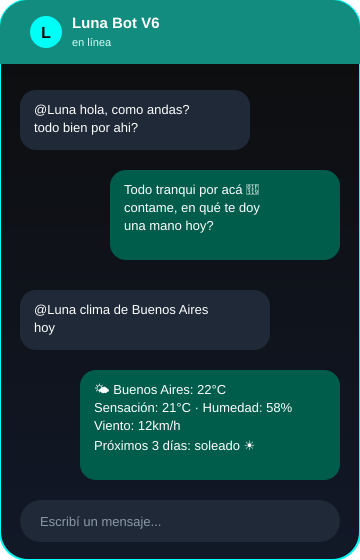
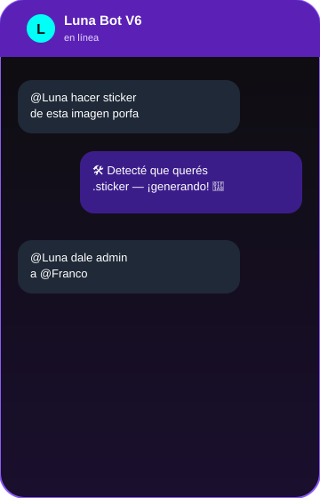
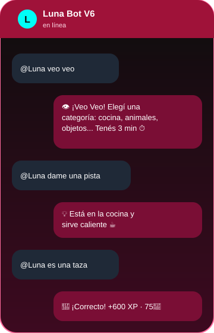

<div align="center">


<br>


<br>

<a href="https://github.com/Luna-botv6/Luna-Botv6-Project">
  
</a>

<br><br>

<p>
  <a href="https://github.com/Luna-botv6/Luna-Botv6-Project">
    
  </a>
  <a href="https://nodejs.org">
    
  </a>
  <a href="LICENSE">
    
  </a>
</p>

<p>
  <a href="https://whatsapp.com/channel/0029VbANyNuLo4hedEWlvJ3Y">
    
  </a>
  
  
</p>

<p>
  
  
  
</p>


</div>

---

<div align="center">

<details open>
<summary><b>🗺️ Tabla de Contenidos — hacé clic para expandir/colapsar</b></summary>

<br>

| 🔗 Sección | 🔗 Sección | 🔗 Sección |
|:---:|:---:|:---:|
| [✨ ¿Qué es Luna Bot?](#-qué-es-luna-bot) | [🎬 Miralo en Acción](#-miralo-en-acción) | [⚖️ Luna vs Otros Bots](#️-luna-vs-otros-bots) |
| [🆕 Últimas Actualizaciones](#-últimas-actualizaciones) | [🟢 Estado del Servicio](#-estado-del-servicio) | [🎮 Juegos](#-juegos-disponibles) |
| [🤖 Luna IA](#-luna-ia--inteligencia-artificial) | [🌟 Características](#-características) | [🛣️ Roadmap](#️-roadmap) |
| [🚀 Instalación Rápida](#-instalación-rápida) | [⚙️ Configuración](#️-configuración) | [⚡ Actualizaciones del Bot](#-sistema-de-actualización-inteligente) |
| [🤝 Contribuir](#-contribuir) | [👨‍💻 Creador](#-creador) | [❤️ Apoyar el Proyecto](#️-apoyar-el-proyecto) |

</details>

</div>

---

<div align="center">

## ✨ ¿Qué es Luna Bot?


</div>

**Luna Bot V6** es un bot de WhatsApp avanzado, de código abierto, construido sobre **@whiskeysockets/baileys**. Pensado para grupos activos que quieren herramientas reales, entretenimiento y una IA que entiende el español rioplatense de forma natural.

```js
const LunaBot = {
  version:     "6.0.0",
  estado:      "🔥 ACTIVO — 24/7",
  tecnologia:  "Baileys + LowDB + IA Multi-Motor",
  plugins:     "290+ comandos organizados por categoría",
  idiomas:     ["🇦🇷 Español", "🇧🇷 Português", "🇺🇸 English"],
  caracteristicas: [
    "🤖 IA conversacional con personalidad argentina",
    "🎮 Juegos multijugador con XP y diamantes",
    "🛡️ Moderación inteligente de grupos",
    "🎵 Descarga YouTube, TikTok, Instagram",
    "💱 Divisas, clima, recetas, letras en tiempo real",
    "📊 Economía virtual con minería y tienda",
    "🌐 Multi-idioma por usuario",
    "⚡ Sistema de caché en disco — siempre rápido",
  ],
};
```

<div align="center">

<table>
<tr>
<td align="center" width="22%">
  
  <br><sub><b>Útiles y Prácticas</b></sub>
</td>
<td align="center" width="22%">
  
  <br><sub><b>Entretenimiento Total</b></sub>
</td>
<td align="center" width="22%">
  
  <br><sub><b>Control de Grupos</b></sub>
</td>
<td align="center" width="22%">
  
  <br><sub><b>Inteligencia Artificial</b></sub>
</td>
</tr>
</table>

</div>

---

<div align="center">

## 🎬 Miralo en Acción


<br><br>

<table>
<tr>
<td align="center" width="33%">

<br><sub><b>💬 Conversación natural</b></sub>
</td>
<td align="center" width="33%">

<br><sub><b>🎯 Comando por lenguaje natural</b></sub>
</td>
<td align="center" width="33%">

<br><sub><b>👁️ Juego Veo Veo</b></sub>
</td>
</tr>
</table>

> [!NOTE]
> Estas son recreaciones ilustrativas de una conversación con Luna, armadas para mostrar el estilo de interacción. Pronto se subiran capturas reales.

</div>

---

<div align="center">

## ⚖️ Luna vs Otros Bots

</div>

| Característica | 🌙 Luna Bot V6 | Bot genérico |
|:---|:---:|:---:|
| IA conversacional sin prefijos | ✅ | ❌ |
| Fallback automático entre motores de IA | ✅ | ❌ |
| Multi-idioma por usuario (ES/EN/PT) | ✅ | ⚠️ Rara vez |
| Caché en disco persistente | ✅ | ❌ |
| Comandos detectados por lenguaje natural | ✅ | ❌ |
| RPG con economía, minería y tienda | ✅ | ⚠️ Básico |
| Compatibilidad LID + números normales | ✅ | ⚠️ Parcial |
| Instalación sin terminal (BoxMine) | ✅ | ❌ |

---

<div align="center">

## 🆕 Últimas Actualizaciones


</div>

<details open>
<summary><b>🗓️ Agosto 2026 — La actualización más grande hasta ahora 🚀</b></summary>

<br>

<p>
  
  
  
</p>

Un mes entero de trabajo — reenvío de canales, un panel de administración que ya reemplaza casi todo lo que antes había que hacer por WhatsApp, y varias funciones nuevas para vos y para los que usan tu bot. Un repaso completo:

### 📡 Reenvío automático de Canales

Un canal de difusión de WhatsApp puede reenviar automático todo lo que postees ahí — a uno o varios grupos, y hasta a **otro canal**. Sin comandos, sin reenviar nada a mano.

| Combinación | Estado |
|:--|:--:|
| Canal → Grupo | ✅ |
| Grupo → Grupo | ✅ |
| Canal → Canal | ✅ |
| Texto / Imagen / Video / Sticker / Audio | ✅ Todos |

- Configuración 100% desde el panel: pegás el link de invitación del canal, elegís el grupo (o canal) receptor, y listo
- Podés vincular tantos grupos/canales como quieras a un mismo canal
- Elegís qué tipos de contenido reenviar (por ejemplo, solo texto e imágenes, sin video)
- Delay anti-ban entre cada envío — más lento con muchos receptores, pero cuida el número del bot
- Pausar, filtrar por tipo, o eliminar el reenvío cuando quieras, todo con un toque

### ✨ Creá comandos personalizados desde el panel

Lo que antes era un ida y vuelta de 5 mensajes por WhatsApp (`.createcode` → `.setmessage` → `.setctag` → `.setimage` → `.setcommand`) ahora es un formulario único: nombre, mensaje, a quién etiqueta, e imagen opcional. El comando queda activo al toque.

> [!TIP]
> El flujo viejo por WhatsApp sigue andando igual que siempre, por si lo preferís — ahora comparte toda la lógica con el panel por dentro.

**Y de yapa, una función nueva dentro de Crear Comando — disparadores por frases, sin comando ni prefijo:**

El bot responde solo cuando alguien escribe una frase específica en el grupo (por ejemplo "soy nueva" o "recién me uní"), sin que nadie tenga que escribir ningún comando.

- Podés cargar varias frases distintas para el mismo disparador
- Elegís si puede dispararlo cualquiera, solo admins, o solo el owner
- Opcional: que la primera vez responda un mensaje, y si esa misma persona repite la frase, responda otro distinto (por ejemplo, para no repetir un saludo de bienvenida dos veces a la misma persona)
- Imagen opcional en cada uno de los dos mensajes
- Funciona en grupos

### 🖥️ Torre de Control — el panel de administración

Tu bot ahora tiene un panel web completo para vos como owner. Para entrar por primera vez:

```bash
.miserver
```

La primera vez te va a pedir crear un usuario y contraseña — **no compartas ni el usuario/contraseña ni el link con nadie**. Las próximas veces, con escribir `.miserver` de nuevo el bot te devuelve el link directo. ¿Te olvidaste la contraseña? No hay drama, el bot te guía paso a paso para restablecerla.

**Todo lo que podés hacer desde ahí:**

| Sección | Qué hace |
|:--|:--|
| 🏠 **Inicio** | Resumen general — subbots conectados, permisos activos, descargas en vivo |
| 📥 **Descargas** | Monitoreo en vivo de lo que se está bajando en cada grupo |
| 🔒 **Permisos por grupo** | Activás o bloqueás la descarga en cada grupo, y le podés poner un **límite diario de descargas** si querés (se resetea solo cada día) |
| 🤖 **Subbots** | Ves cuáles están conectados, desconectás o eliminás en un toque |
| 👥 **Grupo** | Elegís un grupo y desde ahí: mandás mensajes (con imagen, o etiquetando a todos), activás/desactivás funciones del grupo, armás encuestas, configurás el reenvío de canales, o hacés acciones de riesgo (banear el grupo, salir) |
| 👤 **Usuarios** | Buscás a alguien y ves sus baneos, bloqueos y advertencias |
| 🔑 **Owners** | Agregás o quitás owners por número |
| ⚙️ **Funciones de owner** | Switches globales del bot, se aplican al toque |
| 🛠️ **Sistema** | Actualizás el bot a la última versión de GitHub y lo reiniciás |
| 🎵 **Música** | Buscás y reproducís un tema de YouTube ahí mismo |
| ✨ **Crear Comando** | Todo lo explicado arriba |

### 🎨 Stickers nuevos

| Comando | Qué hace |
|:--|:--|
| `.grafiti <texto>` | Sticker animado con letras de grafiti coloridas |
| `.txt <texto>` | Sticker tipo nota, fondo rosado |

</details>

<details>
<summary><b>🌍 28/05/2026 — Sistema Multi-Idioma Global 🌐</b></summary>

<br>

<p>
  
  
  
</p>

El bot ahora habla en el idioma de cada usuario de forma automática. Sin configuración manual, sin mensajes hardcodeados — todo sale del JSON correcto según el idioma guardado en la base de datos.

**Lo que cambió:**
- ✅ Todos los plugins usan variables dinámicas en lugar de texto fijo en español
- ✅ Archivos `es.json`, `en.json` y `pt.json` unificados y completos
- ✅ Estructura centralizada: `plugins.nombre_del_plugin`
- ✅ Sistema escalable para agregar nuevos idiomas sin tocar el código
- ✅ Código más limpio, mantenible y consistente

**Cómo cambiar el idioma:**

```bash
.idioma es   # 🇦🇷 Español
.idioma en   # 🇺🇸 English
.idioma pt   # 🇧🇷 Português
```

El idioma se guarda automáticamente por usuario y todos los mensajes del bot se adaptan de inmediato.

</details>

<details>
<summary><b>✏️ Cambiar el nombre del bot</b></summary>

<br>

<p>
  
  
</p>

```bash
.setnamebot NuevoNombre
```

El nombre se guarda en la base de datos y se aplica de inmediato en todo el bot.
Ejemplo: `.setnamebot Luna IA 🤖`

</details>

<details>
<summary><b>🖼️ Cambiar la imagen / GIF / video del menú</b></summary>

<br>

<p>
  
  
</p>

| Tipo | Cómo hacerlo | Comando |
|:----:|:------------|:-------:|
| 📸 Imagen | Enviá una foto y respondé | `.imgmenu` |
| 🎞️ GIF animado | Enviá un GIF y respondé | `.vidmenu` |
| 🎬 Video corto | Enviá un video (hasta 5 seg) y respondé | `.vidmenu` |

> [!TIP]
> Respondé directamente el mensaje de la imagen o video con el comando. ¡No hace falta reenviarlo!

</details>

---

<div align="center">

## 🟢 Estado del Servicio


<br>

```yaml
🟢 Estado:          Completamente Operativo
📱 Número Oficial:  +54 9 348 351 1079
⏰ Disponibilidad:  24/7 Sin Interrupciones
🌐 Región:          Argentina
💬 Respuestas:      Instantáneas
```

<br>

<a href="https://wa.me/5493483511079">
  
</a>

<br><br>

> [!IMPORTANT]
> El bot está funcionando con normalidad. Para soporte técnico, contactá el número oficial.

</div>


---

<div align="center">

## 🤖 Luna IA — Inteligencia Artificial


<br>


<br>

> *Luna tiene una IA conversacional integrada directamente en el grupo.*
> *No necesitás recordar comandos — solo mencionala y hablale natural.*

</div>

```js
const LunaIA = {
  activacion:   "@Luna + lo que necesites",
  personalidad: "argentina · empática · cálida · auténtica",
  entiende:     "frases naturales en español rioplatense",
  responde:     "en tiempo real dentro del grupo",
  compatible:   "LID · @s.whatsapp.net · números normales",

  capacidades:  [
    "Conversación natural 💬",        "Clima en tiempo real 🌤️",
    "Recetas detalladas 🍽️",           "Letras de canciones 🎵",
    "Info de países 🌍",               "Matemáticas y cálculos 🧮",
    "Conversión de divisas 💱",        "Traducción multiidioma 🌐",
    "Comandos por lenguaje natural 🎯","Imágenes automáticas 🖼️",
  ],

  ia:          "múltiples motores con fallback automático — siempre responde",
  busqueda:    "multi-fuente en paralelo — la mejor respuesta disponible",
  imagenes:    "búsqueda real + generación IA como último recurso",
  juegos:      ["Veo Veo 👁️", "Ahorcado 🎮"],
  moderacion:  ["Mute 🔇", "Kick 👢", "Ban 🚫", "Desmutear ✅"],
};
```

### ⚡ ¿Cómo activarla?

Mencioná a Luna en el grupo con su `@tag` seguido de lo que necesitás. Sin prefijos como `.` o `/` — es una conversación real.

```
@Luna [lo que quieras]
```

---

### 🧠 Motor de IA Multi-Motor con Fallback Automático

Luna usa **múltiples motores de IA en cadena**. Si el primero falla o está ocupado, pasa automáticamente al siguiente sin que el usuario note nada. El orden se aleatoriza para distribuir la carga, y siempre hay un motor garantizado.

> Sin importar la hora ni la carga, Luna **siempre va a responder**.

---

### 🔍 Búsqueda Inteligente Multi-Fuente

Cuando le preguntás algo, Luna consulta **múltiples fuentes al mismo tiempo** y combina la mejor respuesta. Si es corta, la expande con IA antes de responder. Si es extensa y precisa, la manda directamente.

---

### 💬 Conversación Natural

Luna responde en **español rioplatense**, usa "vos", es empática y auténtica. No suena como un robot.

| Frase de ejemplo | Qué hace Luna |
|:----------------|:--------------|
| `@Luna hola, como andas?` | Saluda con calidez |
| `@Luna estoy triste` | Prioriza el acompañamiento emocional |
| `@Luna quien sos?` | Se presenta como IA creada por Germán Miño |
| `@Luna contame un chiste` | Cuenta un chiste con humor argentino |
| `@Luna dame un consejo` | Da consejos genuinos y personalizados |

---

### 🌤️ Clima · 🍽️ Recetas · 🎵 Letras · 🌍 Países · 🧮 Matemáticas · 💱 Divisas · 🌐 Traducción

<details>
<summary><b>🌤️ Clima en Tiempo Real</b></summary>

<br>

| Frase | Acción |
|:------|:-------|
| `@Luna clima de Buenos Aires` | Clima actual + próximos 3 días |
| `@Luna temperatura en Córdoba` | Temperatura actual |
| `@Luna va a llover en Mendoza` | Pronóstico de lluvia |

Incluye: temperatura, sensación térmica, humedad, viento, UV y pronóstico 3 días.

</details>

<details>
<summary><b>🍽️ Recetas Detalladas</b></summary>

<br>

Sistema en tres capas: Base de datos → Wikipedia → IA Generativa

| Frase | Acción |
|:------|:-------|
| `@Luna receta de milanesas` | Receta completa con ingredientes y pasos |
| `@Luna como se hace el asado?` | Preparación paso a paso |

Incluye: ingredientes con medidas exactas, pasos de preparación e imagen del plato.

</details>

<details>
<summary><b>🎵 Letras de Canciones</b></summary>

<br>

| Frase | Acción |
|:------|:-------|
| `@Luna letra de La Noche de Anita` | Letra completa |
| `@Luna letra de Tan Bionica - Ciudad Mágica` | Por artista y canción |
| `@Luna lyrics de El Zorro` | También acepta "lyrics" |

Sistema en cascada: bases de datos → web → generación IA.

</details>

<details>
<summary><b>🌍 Información de Países</b></summary>

<br>

| Frase | Acción |
|:------|:-------|
| `@Luna capital de Francia` | Devuelve la capital |
| `@Luna cuantos habitantes tiene Brasil` | Población actualizada |
| `@Luna moneda de Japón` | Moneda e info económica |

Incluye: nombre oficial, región, capital, población, área, idiomas, moneda y bandera.

</details>

<details>
<summary><b>🧮 Matemáticas y Cálculos</b></summary>

<br>

| Frase | Resultado |
|:------|:---------|
| `@Luna cuanto es 250 * 48` | `🧮 El resultado es: 12000` |
| `@Luna raiz cuadrada de 144` | `🧮 El resultado es: 12` |
| `@Luna 15% de 3500` | `🧮 El resultado es: 525` |

</details>

<details>
<summary><b>💱 Conversión de Divisas en Tiempo Real</b></summary>

<br>

| Frase | Acción |
|:------|:-------|
| `@Luna 100 dolares en pesos` | USD → ARS al momento |
| `@Luna cotizacion del dolar` | Tipo de cambio actual |
| `@Luna 5 mil dolares a pesos chilenos` | Soporta "mil" y "millon" |

Monedas: `USD · EUR · BRL · PEN · COP · MXN · CLP · UYU · PYG · BOB · VES · ARS` y más.

</details>

<details>
<summary><b>🌐 Traducción Multiidioma</b></summary>

<br>

| Frase | Acción |
|:------|:-------|
| `@Luna traducir hola mundo al inglés` | Traduce al idioma pedido |
| `@Luna como se dice gracias en japonés` | Detección automática |

</details>

---

### 🎮 Comandos por Lenguaje Natural

Luna detecta cuando querés ejecutar un comando del bot sin necesidad de escribirlo con prefijo.

<details>
<summary><b>👥 Administración de Grupos</b></summary>

<br>

| Frase natural | Comando equivalente |
|:--------------|:-------------------|
| `@Luna dale admin a @usuario` | `.promote` |
| `@Luna quita de admin a @usuario` | `.demote` |
| `@Luna dame el link del grupo` | `.link` |
| `@Luna cambia el nombre del grupo a Luna Squad` | `.setname Luna Squad` |
| `@Luna info del grupo` | `.infogroup` |

</details>

<details>
<summary><b>🛠️ Herramientas</b></summary>

<br>

| Frase natural | Comando equivalente |
|:--------------|:-------------------|
| `@Luna hacer sticker` | `.sticker` |
| `@Luna traducir al inglés` | `.traducir` |
| `@Luna leer imagen` | `.ocr` |
| `@Luna mandame un meme` | `.meme` |

</details>

<details>
<summary><b>🔇 Moderación desde la IA</b></summary>

<br>

| Frase | Efecto |
|:------|:-------|
| `@Luna mutea a @usuario 30 min` | Silencio por 30 minutos |
| `@Luna expulsa a @usuario` | Expulsa del grupo |
| `@Luna banea este chat` | El bot deja de responder en el grupo |

</details>

<details>
<summary><b>🧙 RPG y Economía</b></summary>

<br>

| Frase natural | Comando equivalente |
|:--------------|:-------------------|
| `@Luna ver mi exp` | `.verexp` |
| `@Luna top del grupo` | `.lb` |
| `@Luna quiero mi recompensa diaria` | `.reclamar` |
| `@Luna minar diamantes` | `.diamondmine` |

</details>

---

### 👁️ Juego: Veo Veo

Luna elige un objeto secreto y tenés **3 minutos** para adivinarlo.

| Categoría | XP | 💎 |
|:----------|:--:|:--:|
| Cocina / Baño / Habitación | 300–600 | 50 |
| Animales / Frutas / Ropa | 400–800 | 75 |
| Objetos / Transporte | 600–1500 | 125 |
| 🔴 Difícil | 1500–3000 | 300 |

```
@Luna veo veo          → Inicia el juego
@Luna dame una pista   → Pide una pista
@Luna es una taza      → Intento de respuesta
```

---

### 🎮 Juego: Ahorcado

| Dificultad | XP | 💎 |
|:-----------|:--:|:--:|
| 🟢 Fácil | 400 | 50 |
| 🟡 Medio | 800 | 100 |
| 🔴 Difícil | 2000 | 250 |

```
@Luna ahorcado facil   → Inicia fácil
@Luna ahorcado dificil → Inicia difícil
@Luna dame una pista   → Pide pista
```

---

### 💾 Sistema de Caché Inteligente

Luna tiene **dos capas de caché persistente** que sobreviven a reinicios del servidor:

**`texto.json`** — Caché de respuestas de la IA. Si alguien pregunta algo similar, Luna responde instantáneamente desde disco sin llamadas externas.

**`plugins-index.json`** — Índice de los 290+ plugins. La detección de comandos es **instantánea** sin tocar la red. Se actualiza automáticamente al recargar plugins.

> [!TIP]
> Podés ver el menú completo de la IA con el comando `.iamenu`


---

<div align="center">

## 🌟 Características

</div>

### 🎮 Entretenimiento
- Sistema de juegos completo (ahorcado, piedra/papel/tijera, tic-tac-toe, buscaminas, batalla naval)
- Máquina tragamonedas con sistema de recompensas
- Veo Veo con IA para elegir el objeto
- Sistema de niveles y experiencia

### 🛠️ Herramientas Útiles
- Descarga de contenido multimedia (YouTube, TikTok, Instagram)
- Generación y lectura de códigos QR
- Convertidor de stickers y multimedia
- Traductor multiidioma integrado
- OCR — lectura de texto en imágenes

### 🛡️ Moderación Avanzada
- Sistema antispam inteligente
- Control de enlaces y contenido
- Sistema de advertencias configurable
- Filtros de palabras personalizables
- Ban/Unban por usuario o por grupo

### 💎 Economía Virtual
- Sistema de minería de diamantes
- Monedas virtuales internas
- Tienda de objetos y mejoras
- Sistema bancario y apuestas

### 🤖 Funciones Inteligentes
- IA integrada para conversaciones naturales
- Respuestas automáticas personalizables
- Sistema AFK (Away From Keyboard)
- Mensajes de bienvenida y despedida configurables
- Multi-idioma por usuario

---

<div align="center">

## 🎮 Juegos Disponibles

</div>

| Juego | Descripción |
|:------|:------------|
|  | Clásico 3 en línea |
|  | Adivina la palabra |
|  | Descubre casillas sin pisar minas |
|  | Compite en carreras de velocidad |
|  | Pon a prueba tu suerte |
|  | Gira la ruleta y ganá premios |
|  | Participá y probá tu suerte |
|  | Piedra, Papel o Tijera |
|  | Hundí la flota enemiga |
|  | Tragamonedas con premios |
|  | IA elige el objeto, vos adivinás |


---

<div align="center">

## 🚀 Instalación Rápida

Elegí tu plataforma y desplegá el acordeón — cada una tiene su guía completa sin que tengas que scrollear todo el README.

</div>

<details>
<summary><b>☁️ BoxMine (Recomendado — sin terminal)</b></summary>

<br>

<div align="center">

<a href="https://boxmineworld.com">
  
</a>

<br>

[](https://boxmineworld.com)
[](https://panel.boxmineworld.com)

</div>

> [!NOTE]
> En BoxMine **no se usa `npm start` ni comandos de terminal**. Todo se maneja desde la consola del panel web. Es la forma más fácil y rápida de poner el bot en línea.

**Enlaces:**

| Recurso | URL |
|:--------|:----|
| 🌐 Sitio Web | [boxmineworld.com](https://boxmineworld.com) |
| 📋 Registro / Área de Clientes | [dash.boxmineworld.com](https://dash.boxmineworld.com) |
| 🖥️ Panel de Control | [panel.boxmineworld.com](https://panel.boxmineworld.com) |
| 📚 Documentación | [docs.boxmineworld.com](https://docs.boxmineworld.com) |
| 💬 Comunidad Discord | [¡Únete aquí!](https://discord.gg/84qsr4v) |

**Paso 1 — Crear cuenta**

Ingresá a [dash.boxmineworld.com/register](https://dash.boxmineworld.com/register), completá usuario, correo y contraseña. Confirmá tu correo.

**Paso 2 — Crear el servidor**

1. En el panel hacé clic en **Crear Servidor**
2. Poné un nombre *(ej: Botluna)*
3. En tipo seleccioná: **Software → Juegos → WhatsApp-bot**
4. En especificaciones elegí: **WhatsApp bot (Luna-Botv6)**
5. En ubicaciones elegí **Free-N6** *(nodo free recomendado)*
6. Deslizá hacia abajo y seleccioná **Crear Servidor**

> [!TIP]
> Si Free-N6 no tiene lugar disponible, probá con **Free-N4** o **Free**. El nodo N6 suele ser el más estable.

**Paso 3 — Entrar al servidor y vincular WhatsApp**

1. En tu lista de servidores hacé clic en **Gestionar**
2. Dentro del panel tocá las **tres líneas** (☰) arriba a la derecha
3. Seleccioná **Consola**
4. Elegí `start` y esperá que se descarguen todas las dependencias

Una vez que termina la instalación verás:

```
Iniciando Luna-Botv6...
Elegí un método para vincular:
1. Código QR
2. Código de 8 dígitos
```

5. Escribí `1` para QR o `2` para código de 8 dígitos
   - Si elegís **2**, ingresá tu número sin espacios *(ej: `+5493483511079`)*
   - El bot te enviará un código de 8 dígitos a tu WhatsApp
   - Ingresalo en WhatsApp: **Configuración → Dispositivos vinculados → Vincular con número**

> [!IMPORTANT]
> En la consola de BoxMine **solo escribís números** para elegir opciones al vincular. No uses `npm start` — el panel lo gestiona todo automáticamente.

</details>

<details>
<summary><b>🪟 Windows</b></summary>

<br>

[](https://nodejs.org/)
[](https://www.microsoft.com/windows)

**Requisitos:** Windows 10/11, internet activa, permisos de administrador.

**Paso 1 — Instalar Git**

Descargar desde **https://git-scm.com/download/win**, instalar con opciones por defecto y marcar **"Add Git to PATH"**.

```bash
git --version
```

**Paso 2 — Instalar Node.js**

Descargar LTS desde **https://nodejs.org/**, marcar **"Add to PATH"** durante la instalación.

```bash
node -v
npm -v
```

**Paso 3 — Arreglar PowerShell** (como Administrador)

```powershell
Set-ExecutionPolicy -Scope CurrentUser RemoteSigned
```

**Paso 4 — Instalar Chocolatey** (como Administrador)

```powershell
Set-ExecutionPolicy Bypass -Scope Process -Force; `
[System.Net.ServicePointManager]::SecurityProtocol = `
[System.Net.ServicePointManager]::SecurityProtocol -bor 3072; `
iex ((New-Object System.Net.WebClient).DownloadString('https://community.chocolatey.org/install.ps1'))
```

```bash
choco -v
```

**Paso 5 — Instalar dependencias**

```bash
choco install python3 ffmpeg imagemagick -y
```

**Paso 6 — Clonar el proyecto**

```bash
git clone https://github.com/Luna-botv6/Luna-Botv6-Project.git
cd Luna-Botv6-Project
```

**Paso 7 — Instalar el bot**

```bash
npm install
```

**Errores comunes:**

<details>
<summary>❌ Error con <code>sharp</code></summary>

```bash
npm uninstall sharp
npm install sharp --os=win32 --cpu=x64
npm rebuild sharp
```

</details>

<details>
<summary>❌ Error con <code>tmp</code></summary>

```bash
mkdir C:\tmp
```

</details>

<details>
<summary>❌ Error de permisos en npm</summary>

```powershell
Set-ExecutionPolicy -Scope Process Bypass
```

</details>

**Paso 8 — Iniciar el bot**

```bash
npm start
```

> Los `npm warnings` y `vulnerabilities` son normales y no bloquean el bot.

**Paso 9 — Vincular WhatsApp**

```
WhatsApp → ⋮ Menú → Dispositivos vinculados → Vincular dispositivo
```

Escaneá el código QR que aparece en la terminal.

</details>

<details>
<summary><b>📱 Android (Termux)</b></summary>

<br>

> [!TIP]
> Instalá Termux desde **F-Droid** (no Play Store): https://f-droid.org/packages/com.termux/

**Paso 1 — Actualizar paquetes:**
```bash
pkg update && pkg upgrade -y
```

**Paso 2 — Instalar Node.js, Git y herramientas:**
```bash
pkg install nodejs git python make clang pkg-config -y
```

**Paso 3 — Clonar el repositorio:**
```bash
git clone https://github.com/Luna-botv6/Luna-Botv6-Project.git
cd Luna-Botv6-Project
```

**Paso 4 — Instalar dependencias:**
```bash
npm install
```

**Paso 5 — Instalar herramientas multimedia:**
```bash
pkg install libvips ffmpeg imagemagick -y
```

**Paso 6 — Instalar dependencias extra:**
```bash
npm install fs-extra && npm install wa-sticker-formatter --force --legacy-peer-deps
```

**Paso 7 — Editar la configuración:**
```bash
nano config.js
```

Para guardar en nano: `Volumen Abajo + O` → Enter → `Volumen Abajo + X`

**Paso 8 — Iniciar el bot:**
```bash
npm start
```

</details>

<details>
<summary><b>🐧 Linux / macOS</b></summary>

<br>

**Linux:**
```bash
git clone https://github.com/Luna-botv6/Luna-Botv6-Project.git
cd Luna-Botv6-Project
sudo apt update && sudo apt install nodejs npm python3 ffmpeg imagemagick -y
npm install
cp config.example.js config.js
nano config.js
npm start
```

**macOS:**
```bash
git clone https://github.com/Luna-botv6/Luna-Botv6-Project.git
cd Luna-Botv6-Project
brew install node python3 ffmpeg imagemagick
npm install
cp config.example.js config.js
nano config.js
npm start
```

</details>


---

## ⚙️ Configuración

Editá el archivo `config.js` con tus datos:

```javascript
global.owner = [
  ['5493483466763', 'Germán Miño', true],
]
global.lidOwners = [
  "128213666649",
];

global.mods  = ['5493483466763']
global.prems = ['5493483466763']

global.packname = 'Luna Bot'
global.author   = 'Germán Miño'
global.wm       = 'Luna Bot V6 - Created by Germán Miño'
```

> [!WARNING]
> Asegurate de agregar tu número en `global.owner` para evitar ser bloqueado por el antispam.

**Para obtener tu LID:** enviá `/miid` al bot. Si responde con `@s.whatsapp.net`, creá un grupo temporal con el bot y usá `/miid` hasta que devuelva un ID con `@lid`.

---

## 🔧 Requisitos del Sistema

| Componente | Versión | Descripción |
|:-----------|:--------|:------------|
| **Node.js** | v18+ | Motor de JavaScript |
| **NPM** | v8+ | Gestor de paquetes |
| **Python** | v3.8+ | Para módulos específicos |
| **FFmpeg** | Latest | Procesamiento multimedia |
| **ImageMagick** | Latest | Manipulación de imágenes |
| **RAM** | 500MB mín. | 700MB+ recomendado |
| **Almacenamiento** | 1.5GB | Espacio libre |

---

## 🚀 Uso y Ejecución

```bash
# Iniciar normalmente
npm start

# Iniciar con PM2 (recomendado para producción)
npm install -g pm2
pm2 start main.js --name "LunaBot"

# Ver logs con PM2
pm2 logs LunaBot
```

---

## 📁 Estructura del Proyecto

```
Luna-Botv6-Project/
├── 📁 database/          # Base de datos JSON (LowDB)
├── 📁 lib/               # Librerías principales
│   └── funcion/
│       ├── pluginHelper.js    # Caché de admins + LID
│       ├── groupMetadata.js   # Metadata de grupos
│       └── lid-resolver.js    # Resolución LID→JID
├── 📁 plugins/           # Comandos del bot (290+)
│   ├── game-*.js              # Juegos
│   ├── tools-*.js             # Herramientas
│   ├── gc-*.js                # Comandos de grupo
│   └── lunaia/                # Sistema IA
├── 📁 src/
│   └── lunaidiomas/      # Archivos de traducción JSON
│       ├── es.json            # Español
│       ├── en.json            # English
│       └── pt.json            # Português
├── 📁 MysticSession/     # Sesión de WhatsApp
├── 📄 main.js            # Archivo principal
├── 📄 handler.js         # Handler de mensajes
└── 📄 config.js          # Configuración
```

---

## ⚡ Sistema de Actualización Inteligente

| Comando | Función | Riesgo |
|:-------:|:--------|:------:|
| `/actualizacion` | Verifica updates disponibles | 🟢 Ninguno |
| `/gitpull` | Actualiza todo | 🟡 Medio |
| `/gitpull --force` | Fuerza actualización | 🔴 Alto |
| `/gitpull omite` | Actualiza protegiendo config | 🟢 Bajo |
| `/restaurar` | Restaura backup | 🟢 Bajo |
| `/eliminarbackup` | Elimina backups | 🟢 Ninguno |


---

<div align="center">

## 🛣️ Roadmap

</div>

- [x] Sistema multi-idioma (ES/EN/PT)
- [x] Personalización de menú (imagen/GIF/video)
- [x] Fallback automático entre motores de IA
- [ ] Panel web de administración para grupos
- [ ] Nuevos juegos multijugador
- [ ] Más idiomas soportados

> [!NOTE]
> Este roadmap se actualiza a medida que se van cerrando features — no representa fechas comprometidas.

---

## 🤝 Contribuir

1. 🍴 Fork el proyecto
2. 🌿 Creá una rama: `git checkout -b feature/NuevaFuncion`
3. 📝 Commiteá tus cambios: `git commit -m 'Add NuevaFuncion'`
4. 📤 Push a la rama: `git push origin feature/NuevaFuncion`
5. 📄 Abrí un Pull Request

---

## 📞 Soporte

<div align="center">

[](https://whatsapp.com/channel/0029VbANyNuLo4hedEWlvJ3Y)

[](https://github.com/Luna-botv6/Luna-Botv6-Project/issues/new?template=bug_report.md)
[](https://github.com/Luna-botv6/Luna-Botv6-Project/issues/new?template=feature_request.md)

</div>

---

## 👨‍💻 Creador

<div align="center">

### 🌙 Germán Miño
*Creador y Desarrollador Principal de Luna Bot V6*

[](https://wa.me/5493483466763)
[](https://discord.com/users/german_coto)
[](mailto:lunabotv6@gmail.com)
[](https://www.facebook.com/profile.php?id=61580601092491)

**📱 WhatsApp:** `+54 9 348 346 6763` · **💬 Discord:** `german_coto` · **📧 Email:** `lunabotv6@gmail.com`

</div>

---

## 🙏 Reconocimientos

Basado en el excelente trabajo de **[Mystic-Bot-MD](https://github.com/BrunoSobrino/TheMystic-Bot-MD)** por [Bruno Sobrino](https://github.com/BrunoSobrino).

---

## ❤️ Apoyar el Proyecto

<div align="center">

[](mailto:gercoto17@gmail.com)
[](#)

**PayPal:** gercoto17@gmail.com · **Mercado Pago:** german.elias.23

**¡Gracias por tu apoyo! 🙌**

</div>

---

## 📄 Licencia

Licenciado bajo la [Licencia MIT](LICENSE).

---

## 🗑️ Registro de Limpieza de Archivos Obsoletos (10 Elementos)

En la última auditoría y refactorización se removieron archivos y directorios obsoletos, duplicados o en desuso que no contaban con referencias ni importaciones activas en el código:

1. **`pipdeps.js`** *(Raíz)*: Script para instalar `yt-dlp` vía pip en el arranque. Quedó obsoleto tras la eliminación de los descargadores de YouTube antiguos.
2. **`lib/downloader-playlist.js`**: Archivo de comando duplicado ubicado por error en `lib/` (el plugin activo está en `plugins/downloader-playlist.js`).
3. **`lib/chatsDB.js`**: Módulo standalone de base de datos de chats sin importaciones en ningún archivo del proyecto.
4. **`lib/logError.js`**: Módulo de registro de errores no importado (`handler.js` utiliza su propia función local `logError`).
5. **`lib/lunaDB.js`**: Adaptador asíncrono sin codificación de JID ni caché, en desuso frente a `lib/funcion/userManager.js`.
6. **`lib/romperprote.js`**: Lógica auxiliar de juego sin importación en los plugins activos.
7. **`lib/tictactoe-db.js`**: Módulo de base de datos de tres en raya no referenciado por ningún plugin.
8. **`lib/funcion/earlyFilter.js`**: Filtro preliminar de mensajes desusado y sin importaciones.
9. **`lib/funcion/usersDB.js`**: Gestor de usuarios antiguo que guardaba en un JSON monolítico (`./database/users.json`), en lugar del sistema actual con Proxy por JID de `userManager.js` (`./database/users/{jid}.json`).
10. **`subbot-commands/`** *(Carpeta y 6 comandos de ejemplo)*: Directorio heredado con comandos estáticos (`s.js`, `play.js`, `menu.js`, `love.js`, `invocar.js`, `facebook.js`). Los SubBots ejecutan de forma nativa todo el catálogo de comandos desde `./plugins/`.

---

<div align="center">


**🌙 Hecho con ❤️ por Germán Miño para la comunidad de WhatsApp**

[](https://github.com/Luna-botv6/Luna-Botv6-Project)
[](https://whatsapp.com/channel/0029VbANyNuLo4hedEWlvJ3Y)

</div>
